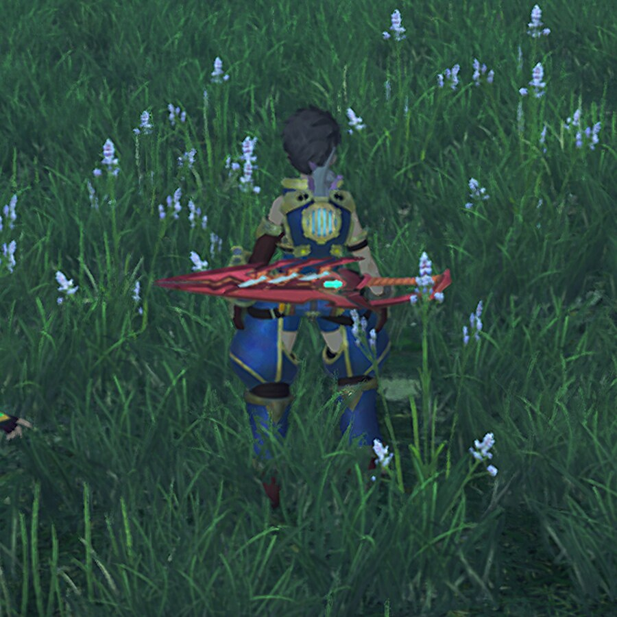
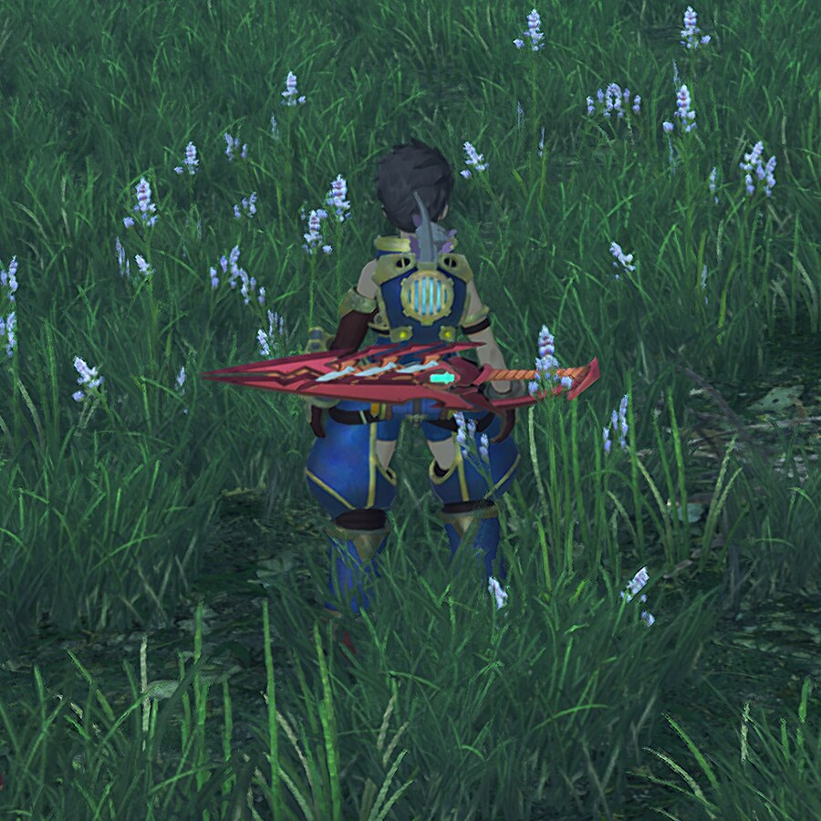

# Xenoblade Chronicles 2 — emulator sharpness patches

Mods that make **Xenoblade Chronicles 2 (v2.1.0)** actually sharp at high internal
resolution in Switch emulators (developed and tested on [Eden](https://eden-emu.dev),
should apply to any yuzu-derived emulator with mod support).

| stock, 3× internal | with these mods, 3× internal |
|---|---|
|  |  |

*(100% crops from 5760×3240 captures — click to view full size)*

## Why XC2 is blurry at any emulator resolution

XC2 renders its 3D scene at **1280×720** but composites it into a **1920×1080**
output framebuffer — a fractional **1.5× bilinear resample of every frame**, baked
into the game. Emulator resolution scaling multiplies *both* sides of that resample,
so the blur survives any multiplier. 3×, 5×, 10× — the last hop is always the same
1.5× bilinear smear (in output-pixel units the interpolation kernel is identical at
every scale). This is why raising the internal resolution never made the game look
sharp, and why the HUD — authored at 1080p and drawn directly into the output
buffer — is always crisp while the world behind it is mud.

Two secondary blur sources stack on top:

- **TMAA**, the game's temporal AA, resolves with 720p-sized sample offsets that an
  emulator's shader rescaler cannot correct — at 3× it blends pixels three times too
  far apart.
- Transparency, "color reduction" and shadow filtering run in **half-resolution
  buffers** (640×360 / 320×360).

## The mods

### `002 Eden 1080p Scene` — the key fix (exefs pchtxt)

Sets the scene resolution to **1920×1080 = output framebuffer**, making the
composite 1:1. Two patched instructions, derived from
[emoose's 1440p patch](https://gist.github.com/emoose/93a81ff4944933cafe64160a91f2acbe):

```
006FFDC0 15F08052    # MOVZ W21,#1920 — scene width  (emoose 1440p: #2560)
006FFDC4 16878052    # MOVZ W22,#1080 — scene height (emoose 1440p: #1440)
```

With scene == output, the emulator multiplier becomes a clean quality dial:
every setting is a 1:1 pipeline (2× = true 2160p, 3× = 3240p supersampled).

Measured on fixed crops of 3× captures (Laplacian variance — fine-detail energy):

| configuration | grass | rocks | HUD text |
|---|---:|---:|---:|
| stock | 37.9 | 46.0 | 15.1 |
| TMAA off + full-res buffers (001 only) | 46.9 | 43.9 | 19.2 |
| **+ 1080p scene patch (001 + 002)** | **296.7** | **291.0** | **86.9** |

### `001 Eden Sharp Graphics` — companion config (romfs lib_nx.ini)

Disables the remaining blur sources via Monolith's engine config. The engine reads
`romfs/stream/dumpini/lib_nx.ini` **natively** as a developer override path — plain
LayeredFS, no exefs patch required (contrary to what some older mod packs assume).

```ini
AntiAliasing=off     ; spatial AA + its halo-prone sharpening
tmaa=off             ; the temporal AA smear
TransReduction=off   ; full-resolution transparency (hair, effects)
trans_red_sclX=1.0
trans_red_sclY=1.0
ColReduction=off     ; full-resolution color/effect buffers
shadowHalf=off       ; full-resolution shadow filtering
```

If distant edges shimmer in motion (there is no AA at all with the defaults above),
edit the ini: `AntiAliasing=on` + `AA_Sharpness=0.3` — mild sharpness cost, no halos.

## Installation

1. Copy both folders from `mods/` into your emulator's mod directory for XC2:
   - Eden / yuzu-likes: `<data dir>/load/0100E95004038000/`
2. Recommended companions (GBAtemp / theboy181's
   [switch-ptchtxt-mods](https://github.com/theboy181/switch-ptchtxt-mods)):
   **Disable Resolution Scaling** (pins dynamic resolution so the 1080p base never
   drops) and **Improved LOD**.
3. Set the emulator's internal resolution multiplier:
   - **2×** → true 2160p end-to-end, pixel-perfect on a 4K display
   - **3×** → 3240p, downsampled to your display (acts as SSAA; useful with TMAA off)
4. Disable other graphics mods that ship a `lib_nx.ini` (e.g. the GBAtemp
   "AA & Awful Filter Killer") — two mods must not provide the same file.

### Compatibility

- Game version **2.1.0**, title ID `0100E95004038000`,
  `main` build ID `F77F1559371C0EC6D50E78774AC59D95` (the pchtxt is nsobid-gated —
  it will silently not apply on a different dump; check your log for
  `build_id=F77F1559...`).
- Real hardware: untested. The lib_nx.ini works, but full-res effect buffers +
  1080p scene will likely be too heavy for a stock Switch.

## Notes & findings

- **A 2160p scene variant does not work**: `MOVZ #3840/#2160` at the same addresses
  makes the game abort at boot (`nn::diag` assertion inside the framebuffer init
  code — an engine-baked limit, not out-of-memory; an 8 GB emulated memory layout
  doesn't help). emoose hit the same wall in 2019.
- **1440p (emoose's original) is not recommended** here: 1440→1080 re-introduces a
  fractional (0.75×) composite — exactly the artifact class this repo removes.
- `red_sclX/Y` and friends in `lib_nx.ini` are **inert in XC2** (they work in later
  Xenoblade titles). Resolution must be patched in code — that's why this repo
  contains a pchtxt at all.
- Game-side supersampling (e.g. the "SuperSampling x2" pchtxt) barely helps on
  emulators: the higher-res scene is still resampled fractionally into the 1080p
  output buffer.

## Credits

- [emoose](https://gist.github.com/emoose/93a81ff4944933cafe64160a91f2acbe) — found
  the resolution instructions in the executable; this repo's pchtxt swaps his 1440p
  values for 1080p.
- [theboy181](https://github.com/theboy181/switch-ptchtxt-mods) — XC2 pchtxt mods
  (Disable Resolution Scaling, Improved LOD, SuperSampling ×2) used during testing.
- The GBAtemp [XBC2 Graphics Settings](https://gbatemp.net/threads/xenoblade-chronicles-2-graphics-settings.529436/)
  community — `lib_nx.ini` settings documentation; `001`'s ini is based on that
  work's config baseline.

## License

MIT for the contents of this repository. The `lib_nx.ini` schema/defaults originate
from the game's engine configuration; the pchtxt technique builds on emoose's
published research (see credits).
